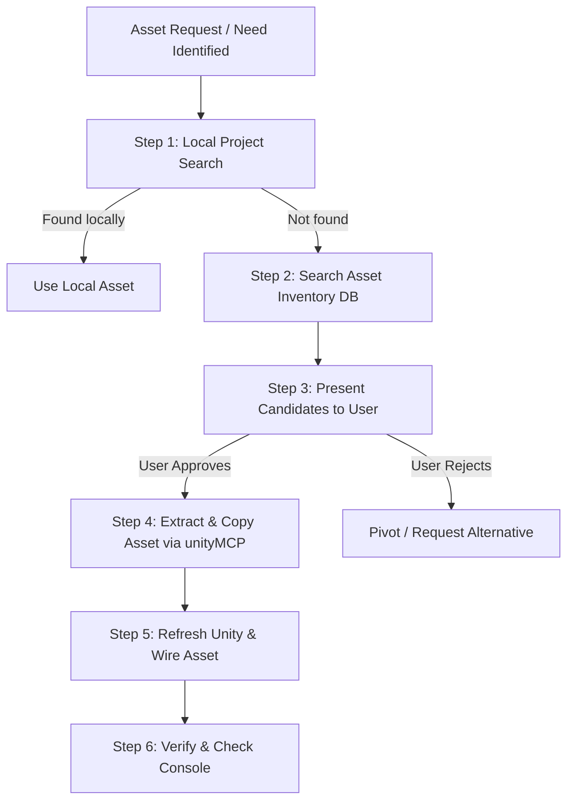

# Find and Import Missing Assets via Asset Inventory

This skill defines the workflow for finding and importing missing assets (sound effects, UI icons, textures, 3D models, or prefabs) from the local **Asset Inventory** database (`Assets/AssetInventory/`) when a feature or UI element requires an asset not currently present in `Assets/Bladehold/`.

---

## Workflow Overview



---

## Step 1 — Local Project Search

Before querying external caches, search the local project directories (`Assets/Bladehold/`, `Assets/Third Party/`, `Assets/Synty/`) using `grep_search` or `list_dir` to ensure the required asset does not already exist.

Examples:
- Check for existing footstep sounds: search `Assets/Bladehold/Audio/` or `Assets/Third Party/` for `.wav` / `.mp3`.
- Check for existing skill icons: search `Assets/Bladehold/UI/` or `Assets/Bladehold/Sprites/`.

If the asset already exists locally, use it directly and skip Asset Inventory.

---

## Step 2 — Search Asset Inventory Database

If the asset is missing locally, run a C# query against `AssetInventory.DBAdapter.DB` using `unityMCP`'s `execute_code` tool to locate matches in the user's indexed Asset Inventory cache.

### Ready-to-Use Search Snippet (unityMCP `execute_code`)

Run with `action: "execute"`:

```csharp
string searchTerm = "footstep"; // Change keyword as needed
string typeExtension = ".wav"; // ".wav", ".mp3", ".png", ".prefab", etc.

var files = AssetInventory.DBAdapter.DB.Table<AssetInventory.AssetFile>()
    .Where(f => f.FileName.Contains(searchTerm) && (string.IsNullOrEmpty(typeExtension) || f.FileName.EndsWith(typeExtension)))
    .Take(10)
    .ToList();

string result = $"Found {files.Count} matching assets for '{searchTerm}':\n";
foreach (var f in files)
{
    var asset = AssetInventory.DBAdapter.DB.Table<AssetInventory.Asset>()
        .Where(a => a.Id == f.AssetId)
        .FirstOrDefault();
    string assetName = asset != null ? asset.DisplayName : "Unknown Asset Package";
    result += $"- FileID: {f.Id} | File: {f.FileName} | Package: {assetName} | Path: {f.Path}\n";
}
return result;
```

---

## Step 3 — Present Candidate Assets to User for Approval

**CRITICAL**: Do **NOT** download or import assets without explicit user consent.

Formulate a clear proposal using `ask_question` or output markdown listing the top candidate matches found:

1. Display the file name, audio/image format, source package name, and suggested import destination (e.g. `Assets/Bladehold/Audio/Footsteps/`).
2. Ask the user which candidate(s) they want to import, or if they would prefer a different search query.

---

## Step 4 — Extract & Copy Asset into Project

Once the user approves a specific candidate asset, extract and copy it into the target project directory using `AssetInventory.AI.CopyTo` via `unityMCP` `execute_code`.

### Ready-to-Use Import Snippet (unityMCP `execute_code`)

Run with `action: "execute"`:

```csharp
int targetFileId = 68979; // Replace with approved FileID from Step 2
string destinationFolder = "Assets/Bladehold/Audio/Footsteps"; // Target folder in project

var file = AssetInventory.DBAdapter.DB.Table<AssetInventory.AssetFile>()
    .Where(f => f.Id == targetFileId)
    .FirstOrDefault();

if (file == null) return $"Error: FileID {targetFileId} not found in database.";

var asset = AssetInventory.DBAdapter.DB.Table<AssetInventory.Asset>()
    .Where(a => a.Id == file.AssetId)
    .FirstOrDefault();

var info = new AssetInventory.AssetInfo(asset);
var method = typeof(AssetInventory.AssetInfo).GetMethod(
    "CopyFrom", 
    System.Reflection.BindingFlags.NonPublic | System.Reflection.BindingFlags.Instance, 
    null, 
    new System.Type[] { typeof(AssetInventory.Asset), typeof(AssetInventory.AssetFile) }, 
    null
);
method.Invoke(info, new object[] { asset, file });

var task = AssetInventory.AI.CopyTo(info, destinationFolder);
task.Wait();
string importedPath = task.Result;

return $"Successfully imported asset to: {importedPath}";
```

---

## Step 5 — Refresh & Wire Asset in Unity

1. Call `refresh_unity` via `unityMCP` (or `AssetDatabase.Refresh()`) so Unity detects the newly added asset.
2. Wire the imported asset to the relevant component, ScriptableObject, or UI element:
   - For audio: Assign `AudioClip` to `AudioSource` or Feel feedback (`MMF_Player`).
   - For icons: Ensure Texture Importer is set to `Sprite (2D and UI)`, then assign to `Image.sprite` or `SkillNodeSO.icon`.
   - For 3D models: Create/wire prefab as needed.

---

## Step 6 — Verification

1. Run `/compile-check` to confirm all C# scripts compile cleanly.
2. Check Unity Editor console via `unityMCP` `read_console` to ensure zero errors or missing reference warnings.
