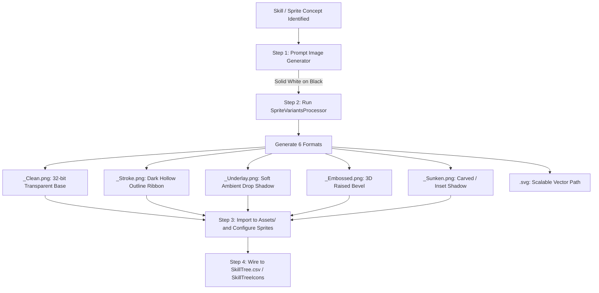

# Generate Sprites & UI Variants

This skill defines the end-to-end workflow for generating new 2D skill icons, status badges, and UI sprites matching the **Synty low-poly monochrome aesthetic** in Bladehold (`Assets/Synty/InterfaceFantasyWarriorHUD/Sprites/Icons_Status/`), and batch-generating their standard variant suites (**Clean**, **Stroke**, **Underlay**, **Embossed**, **Sunken**, and **SVG** vector paths).

---

## Workflow Overview



---

## Visual Style Guidelines (Synty Low-Poly Aesthetic)

To ensure generated sprites seamlessly blend with existing Synty UI assets:

1. **Monochrome High Contrast**: Pure solid white (`#FFFFFF`) silhouette on pure solid black (`#000000`) background during AI generation.
2. **Minimalist, Chunky Geometry**: Strong, readable shapes with faceted, angled low-poly corners. Avoid tiny lines, busy internal detailing, filigree, or photographic textures.
3. **High Readability at 32x32**: If an icon cannot be instantly recognized when scaled down to 32px or 64px on a mobile/HUD screen, simplify the shape.
4. **Reference Images**: Always supply the 3 canonical reference images to `generate_image`:
   - `Assets/Synty/InterfaceFantasyWarriorHUD/Sprites/Icons_Status/ICON_FantasyWarrior_Status_Attack_01_Clean.png`
   - `Assets/Synty/InterfaceFantasyWarriorHUD/Sprites/Icons_Status/ICON_FantasyWarrior_Status_Health_01_Clean.png`
   - `Assets/Synty/InterfaceFantasyWarriorHUD/Sprites/Icons_Status/ICON_FantasyWarrior_Status_Burninating_01_Clean.png`

---

## Step 1 — Prompting the Image Generator

Call `generate_image` with `AspectRatio: "1:1"` and the prompt template below:

### Prompt Template
```text
An ultra-simple, minimalist 2D flat game UI skill sprite icon representing [SKILL NAME / CONCEPT]. Perfectly matching the reference images: pure solid white chunky silhouette on a solid pitch black background. [1-2 sentences describing the single iconic shape, e.g. 'A single stylized low-poly battle axe with faceted head']. Bold low-poly geometric faceted contours, thick readable silhouette, zero noise, zero fine lines, zero background clutter, simple flat game HUD icon.
```

### Example Calls
- **Throwing Axe**: `"A single stylized Viking battle axe angled diagonally with clean faceted blade and pommel."`
- **Spike Barricades**: `"Three sharp chunky geometric wooden/iron defense ground spikes angled upwards from a flat base."`
- **Multi Shot**: `"Three simple stylized low-poly fantasy arrows fanning outward in a clean flight formation."`
- **Vampiric Blade**: `"A straight broadsword paired with a bold, faceted low-poly blood droplet beside the blade."`

---

## Step 2 — Processing Variants via `SpriteVariantsProcessor`

The source AI output is a solid white silhouette on black. Use the included `SpriteVariantsProcessor` (`scripts/SpriteVariantsProcessor.cs`) or `dotnet run` to convert the raw image into all 6 standard variants in under 0.5s per image:

### Available Variant Formats

| Variant Suffix | Description | Use Case in Bladehold |
|---|---|---|
| **`_Clean.png`** | 32-bit transparent PNG (pure white silhouette). | Default UI Sprite for buttons, cards, and HUD slots. |
| **`_Stroke.png`** | Dark outer contour ribbon (`#3B3B3B`, 14px radius) with hollow interior. | Overlay outline for selected / hover states or high-contrast borders. |
| **`_Underlay.png`** | Solid white silhouette with soft diffused ambient drop shadow. | Default Synty HUD status icon format (ensures readability over 3D gameplay). |
| **`_Embossed.png`** | 3D raised metal/stone badge effect with directional lighting. | Active / triggered ability states, ultimate badges. |
| **`_Sunken.png`** | Inset / engraved stone effect with recessed inner shadow. | Locked / unpurchased skill tree nodes, passive sockets. |
| **`.svg`** | Scalable vector path (Marching Squares + RDP polygon reduction). | Vector web documentation, resolution-independent vector UI. |

---

## Step 3 — CLI / Automation Script

To run the processor over newly generated images:

```bash
dotnet run --project "<path_to_SpriteVariants_project>"
```

Or call the C# API directly in Unity / .NET:
```csharp
Bladehold.Tools.SpriteVariantsProcessor.ProcessFile(
    inputPath: @"C:\path\to\ai_generated_image.jpg",
    outputDir: @"Assets/Bladehold/Art/Icons/",
    baseName: "skill_whirlwind"
);
```

### Performance Benchmarks
- **SVG Vectorization**: **~15–20 ms** per image (Marching squares + RDP polygon reduction).
- **All 5 PNG Shaders**: **~100–150 ms** per image (Raw pixel buffer processing).
- **Total Batch Execution**: **~2–3 seconds** for 5 skills across all 6 formats.

---

## Step 4 — Unity Import Settings

When copying generated `.png` files into `Assets/Bladehold/Art/Icons/`:

1. **Texture Type**: `Sprite (2D and UI)`
2. **Sprite Mode**: `Single`
3. **Alpha Source**: `Input Texture Alpha`
4. **Alpha Is Transparency**: `Checked (True)`
5. **Wrap Mode**: `Clamp`
6. **Filter Mode**: `Bilinear` (or `Point` if retro pixel style is desired)

---

## Step 5 — Wiring to Skill Tree Configuration

1. Place the generated sprite assets in `Assets/Bladehold/Art/Icons/` or `Assets/Synty/InterfaceFantasyWarriorHUD/Sprites/Icons_Status/`.
2. Add the sprite reference to the `SkillTreeIcons.asset` dictionary mapping (or `SkillTree.csv` icon column).
3. If referenced in `SkillTree.csv`, assign the sprite filename (without extension) to the `icon` column of the corresponding skill row.
4. Run `refresh_unity` to compile and update asset database caches.
